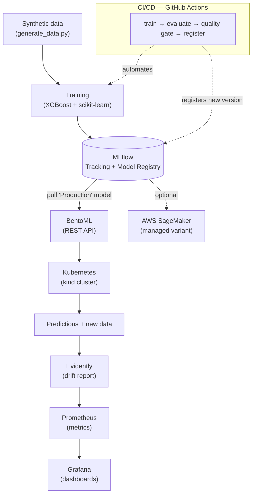

# Architecture — ComplianceML

End-to-end MLOps pipeline: from synthetic data to a monitored model served on Kubernetes,
with automated retraining via CI/CD.

## Flow diagram

## Components

| Stage | Tool | Purpose |
|---|---|---|
| Data | `generate_data.py` | Reproducible **synthetic** compliance-risk dataset (seed-based). |
| Training | scikit-learn / XGBoost | Binary classifier: high vs. low risk. |
| Tracking + Registry | **MLflow** | Logs params/metrics per run; versions and promotes models. |
| Serving | **BentoML** | Wraps the registered model as a REST API. |
| Orchestration | **Kubernetes (kind)** | Runs the serving API locally; scaling, health, restarts. |
| CI/CD | **GitHub Actions** | Automated retrain → evaluate → quality gate → register. |
| Drift monitoring | **Evidently** | Detects data drift between training and live data. |
| Observability | **Prometheus + Grafana** | Collects and visualizes metrics (latency, drift, throughput). |
| IaC | **Terraform** | Declarative, reproducible infrastructure. |
| Cloud (optional) | **AWS SageMaker** | Managed variant of the same lifecycle. |

## Design principles
- **Reproducibility:** versioned data generator (not the data), pinned dependencies (uv + lockfile).
- **Security:** no secrets, no real/proprietary data — everything synthetic.
- **Portability:** the open-source stack (MLflow, Kubernetes) maps 1:1 to managed cloud services.
